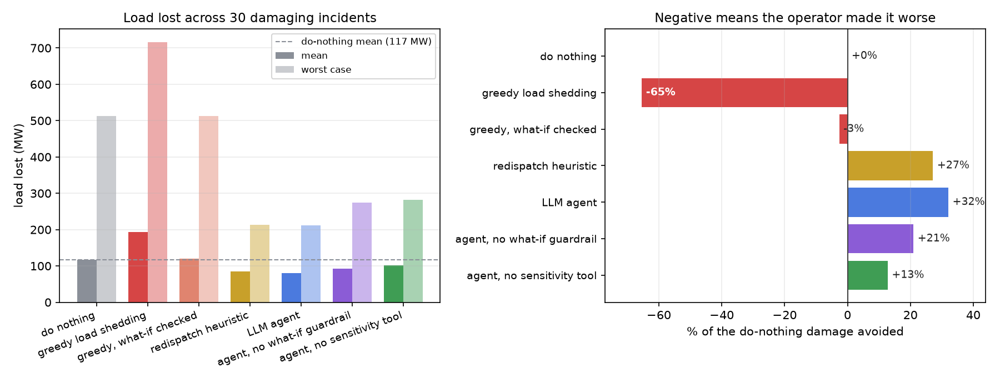
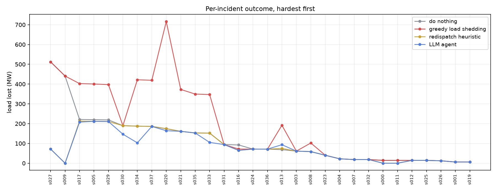

# GridPilot

An LLM agent operating a power grid during a cascading failure. Click a
transmission line to trip it, watch the overloads spread, and hand control to
an agent that has to diagnose the fault and act before protection relays do.

Everything runs on real power-flow physics: the IEEE 118-bus test case solved
with [pandapower](https://www.pandapower.org/), thermal limits sized the way
transmission planners size them, protection relays with time delays, islanding,
and under-frequency load shedding.


Above is one incident from the benchmark. Peak demand, a line trips, and ten
more lines are suddenly over their thermal limits with 441 MW of load about to
go dark. The operator has one window before the relays act: three generator
setpoint changes, no customers dropped, nothing overloaded. Regenerate it with
`uv run python -m gridpilot.render --seed 9`.

## Does the agent actually help?

Not obviously — which is why the benchmark exists. Fifty seeded incidents,
each replayed under four operators, scored on megawatts of load lost
(shedding counts against you, because a customer without power does not care
why).

| policy | mean MW lost | worst MW | damage avoided | contained | made worse | benign incidents damaged |
|---|---|---|---|---|---|---|
| do nothing | 117 | 512 | +0% | 0 | 0 | 0 |
| greedy load shedding | 194 | 716 | **-65%** | 0 | 11 / 30 | 2 |
| greedy, what-if checked | 120 | 512 | -3% | 0 | 1 / 30 | 0 |
| redispatch heuristic | 85 | 213 | +27% | 3 | 1 / 30 | 0 |
| **LLM agent** | **80** | **212** | **+32%** | 3 | 1 / 30 | 0 |



Removing either of the agent's two thinking tools costs more than the agent's
entire margin over the heuristic:

| agent configuration | mean MW lost | damage avoided | incidents made worse |
|---|---|---|---|
| full | 80 | +32% | 1 / 30 |
| without the what-if guardrail | 93 | +21% | 3 / 30 |
| without the sensitivity tool | 102 | +13% | 2 / 30 |

Blind redispatch is worse than unchecked redispatch: an agent that cannot ask
which generators affect which line spends its reserve on units that do not help,
and only avoids 13% of the damage. Both ablations ran on the same 30 damaging
incidents; the sensitivity ablation skipped the benign set, so its
benign-damage figure is not comparable and is omitted.

Four findings worth more than the headline number:

**An eager operator is worse than no operator.** Greedy load shedding — the
obvious rule, shed near whatever is overloaded — loses 65% *more* load than
walking away, makes 11 of 30 incidents worse, and damages 2 incidents the grid
would have absorbed on its own. Shedding to relieve a line spends exactly the
thing you are trying to protect.

**The agent's edge over a strong heuristic is real but narrow.** Against the
redispatch heuristic it wins 5 incidents, ties 24, and loses 1. It is not
finding a strategy the heuristic lacks; it occasionally finds a better
combination of the same moves. Reporting the tie count matters more than
reporting the mean.

**Schema friction costs load.** In early runs the agent burned three of its
eight turns per incident guessing field names (`new_mw`, `setpoint`,
`action_type`) before landing a valid call — and in this simulation turns are
the window before a relay trips. Rewriting the validation errors to quote the
correct shape took invalid actions from routine to 3 across 264 turns, with no
change to the model or the prompt. Error message text is a latency budget.

**The guardrail earns its keep, but it is not the main lever.** Forcing every
plan through a simulate-before-commit check is worth 13 MW and cuts
made-things-worse incidents from 3 to 1. Giving the agent sensitivity
information is worth almost twice that. Guardrails stop bad decisions;
better information prevents them.



## What the operator can do

Four levers, all as tool calls: `redispatch` a generator, `shed_load` at a
bus, and `open_line` / `close_line`. Plus two read-only tools that make the
difference between guessing and deciding:

- **`relief_options(line)`** — which generators relieve this line, and by how
  much per MW. Computed by finite difference: nudge each candidate generator on
  a cloned grid, re-solve, read the change. This is what PTDF sensitivity
  factors give a real control room. (Pulling the PTDF matrix out of pandapower
  directly would be faster, but its branch ordering does not line up with the
  line table, and a silent misalignment produces confidently wrong advice.)
- **`what_if(actions)`** — apply a plan to a cloned grid, let the cascade play
  out, and report what *would* happen versus doing nothing. Nothing is
  committed.

## The guardrail is code, not a prompt

The prompt tells the agent it *can* simulate before acting. Whether it does is
not left to good intentions:

- every action is schema-validated, and the error quotes the correct shape
- protected buses (hospitals, water treatment) are unsheddable — enforced in
  `validate()`, not requested in the prompt
- at most 4 actions per tick, at most 120 MW shed per action
- with `require_what_if` on, a plan is simulated before it is committed and
  **rejected if it would lose more load than doing nothing**

That last one is the interesting mechanism, and it applies to the heuristics
too. The same greedy shedding policy, with every plan forced through the same
check:

| | mean MW lost | damage avoided | incidents made worse | benign incidents damaged |
|---|---|---|---|---|
| greedy shedding | 194 | -65% | 11 / 30 | 2 |
| greedy shedding, checked | 120 | -3% | 1 / 30 | 0 |

The guardrail cannot make a bad policy good — checked greedy still never beats
walking away. It can stop it from being actively harmful, and it does so
without changing a line of the policy's logic.

## Why the timing works the way it does

Each tick: scheduled faults trip lines → **the operator sees the result and may
act** → protection relays act on whatever is still overloaded.

The operator's window sits *before* protection, and that ordering is the whole
game. A line over 100% trips after two ticks, or immediately above 140%.
Emergency control has to beat the relay to be worth anything; acting after the
trip is cleanup. An earlier version of the runner consulted the operator after
protection and the agent looked useless, because by the time it was asked, every
decision had already been made for it.

The operator is called at *decision points* — a fresh disturbance, or a live
overload — not every tick. Some incidents (a corridor cut splitting the system)
destroy load through islanding without ever overloading a line, so a policy that
only reacts to overloads would never be consulted at all, and would score
deceptively well.

## The physics, and where it is simplified

Choices that matter for whether the results mean anything:

- **DC power flow**, not AC. Always converges, which a cascade loop needs. No
  reactive power or voltage collapse, so voltage-driven cascades are out of scope.
- **Thermal limits are sized for N-1 security**, the way planners size them:
  each line is rated for the worst flow it sees across every single-line
  contingency, plus 5%. The base case then sits at 48% median loading and *no
  single line trip overloads anything* (tested). Difficulty comes from
  correlated faults, not from starting out overloaded. Sizing limits from
  base-case flows instead — the obvious shortcut — makes half of all single
  contingencies unsafe and the grid absurdly fragile.
- **Generators contribute spinning reserve, not nameplate.** On a cascade
  timescale a unit can move about 10% above its current output. Letting islands
  ramp to nameplate makes them self-supply and islanding stops costing anything,
  which is the opposite of how real blackouts hurt.
- **The slack bus has a finite reserve** (125% of its base dispatch). Left
  unbounded it makes the main island immune to generation deficit.
- **Transformer ratings are left alone.** pandapower derives transformer
  impedance from `vk_percent` relative to `sn_mva`, so rescaling the rating
  silently changes the power flow. There is a regression test asserting that
  limit setup does not move any line flow.
- Only lines trip; transformers stay in service. Load shedding is proportional
  within a bus rather than per-feeder.

## Incidents

Random line pairs almost never interact, so scenarios are correlated faults:

| kind | what happens |
|---|---|
| `substation` | busbar fault: two lines out of the same substation trip together |
| `corridor` | a genuine cut set fails progressively, splitting the system into two large islands |
| `storm` | a front walks outward from a bus, dropping a line every couple of ticks |
| `peak_n1` | 105% of nominal demand, then two trips on heavily loaded corridors |

Fifty are screened into a fixed benchmark: 30 where doing nothing loses load,
and 20 the grid absorbs unaided. The benign 20 are not filler — they are the
trap for the failure mode that killed the greedy heuristic, and the reason
"benign incidents damaged" is a column in the results table.

## Running it

Needs [uv](https://docs.astral.sh/uv/). The agent uses your local `claude`
CLI by default, so there is no API key to configure; set `ANTHROPIC_API_KEY`
and it uses the SDK instead.

```bash
uv sync

# the interactive demo
uv run uvicorn gridpilot.server:app --port 8137     # then open localhost:8137

# rebuild the scenario benchmark (screens seeds by no-action outcome)
uv run python -m gridpilot.benchmark

# heuristics: seconds. agents: minutes, and parallel across scenarios
uv run python -m gridpilot.evaluate --policies no_action greedy_shed redispatch_relief \
    --tag heuristics
uv run python -m gridpilot.evaluate --policies agent --workers 6 --tag agent_full
uv run python -m gridpilot.evaluate --policies agent_no_guardrail agent_no_sensitivity \
    --workers 6 --tag ablations

uv run python -m gridpilot.plots
```

```
gridpilot/
  grid.py         case setup, N-1 secure limit sizing, layout
  cascade.py      protection, islanding, power balance, the tick loop
  scenarios.py    seeded incidents, cut-set discovery
  benchmark.py    screens seeds into a fixed damaging/benign set
  tools.py        the operator's action surface, validation, what-if guardrail
  sensitivity.py  which generators relieve which line
  policies.py     do-nothing, greedy shedding, redispatch heuristic
  agent.py        the LLM operator and its tool loop
  runner.py       one incident under one policy
  evaluate.py     batch eval, parallel, summary metrics
  server.py       FastAPI + websocket for the live demo
frontend/         SVG grid map, no build step
tests/            physics invariants, guardrail enforcement, tool validation
```

## References

- [pandapower](https://www.pandapower.org/) and the IEEE 118-bus test case
- Dobson et al., [Complex systems analysis of series of blackouts](https://doi.org/10.1063/1.2737822)
  — cascading failure modelling and the role of loading margin
- [NERC disturbance reports](https://www.nerc.com/pa/rrm/ea/Pages/default.aspx)
  for how real cascades actually unfold
